# MERN STACK IMPLEMENTATION

## The task for this project is to deploy a simple application that creates To-Do list

### STEP 1- Backend Configuration

1. I unpdated and upgraded the server package

  `sudo apt update`

  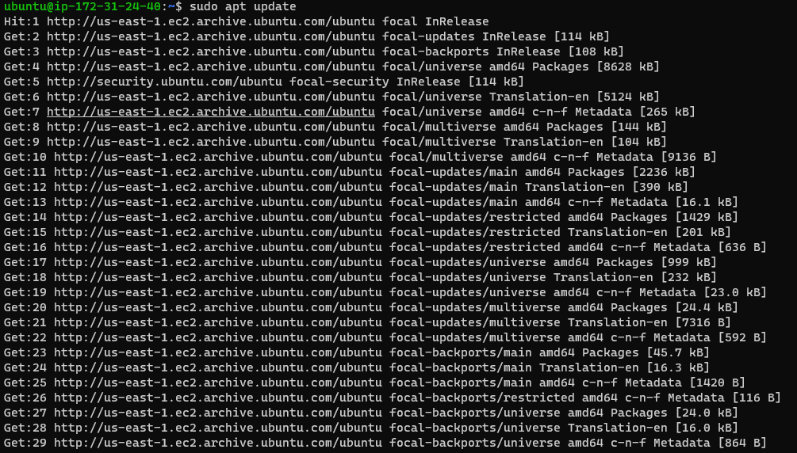

  `sudo apt upgrade`

  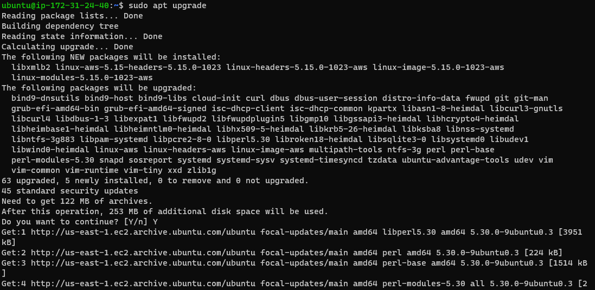

 2. To get the location of the Node.js software,

  `curl -fsSL https://deb.nodesource.com/setup_18.x | sudo -E bash -`

  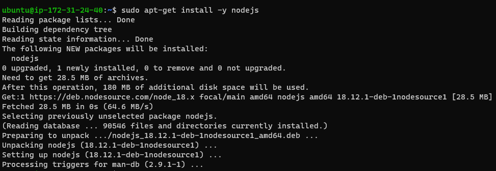

 3. Install Node.Js

  `sudo apt-get install -y nodejs`

  

 4. Checked the version of Node and NPM

  `node -v`

  `npm -v`

  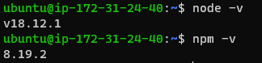

 5. Created a new directory 'Todo', changed directory to 'Todo' and initialised the task

   `mkdir Todo`

   `cd Todo`

   `npm init`

   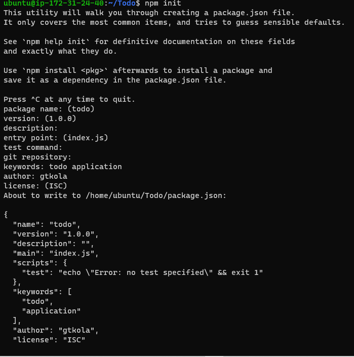

 6. Then checked for Package.Json

   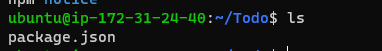  

 ### Install ExpressJs

 7. Installed ExpressJs

   `npm install express`

   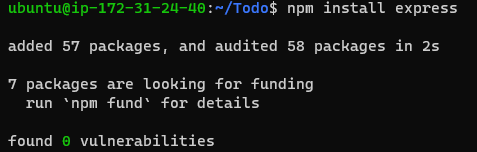

 8. Created file index.js

   `touch index.js`

   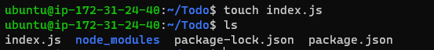

 9. Installed dotenv

   `npm install dotenv`

   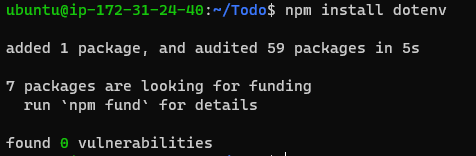

 10. Checked server status

   `node index.js`

   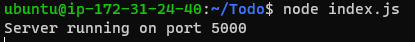

 11. Access server on Public IP

   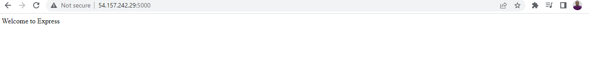

 12. Created a new directory names ROUTES and changed directory to ROUTES

   `mkdir routes`
   `cd routes`

   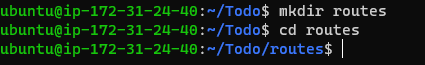

 13. Create a file api.js and open to save lines of code

  `touch api.js`

  `vim api.js`

  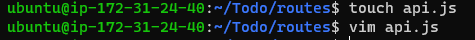

    
 14. Install mongoose

   `npm install mongoose`

   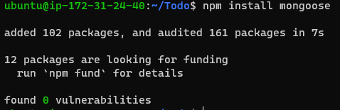

 15. Created a new file MODELS and chnaged directory to MODELS

   `mkdir models`

   `cd models`

   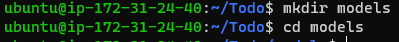

 16. Created todo.js file

   `touch todo.js`
   
   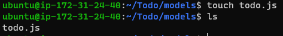

 17. Opened  file todo.js

   `vim todo.js`

   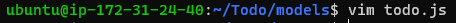

 18. Update and Open api.js in routes directory

  `vim api.js`

   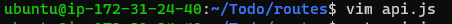

 ### MongoDB Database

 19. Create a file '.env' in Todo and open the file.

  `touch .env`

  `vi .env`
  
  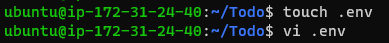

 20. Add the connection string to access the database

  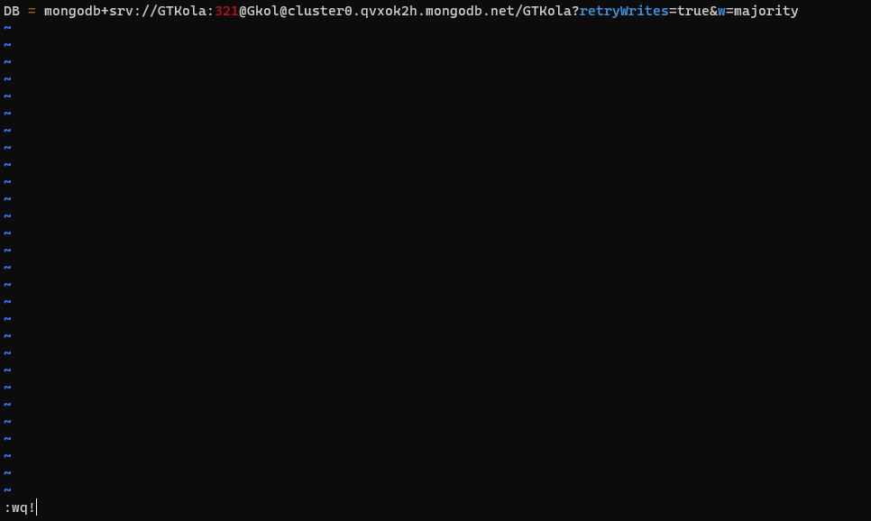

 21. Update Index.js

   `vim index.js`

   Reveal content of index.js

   `cat index.js`

   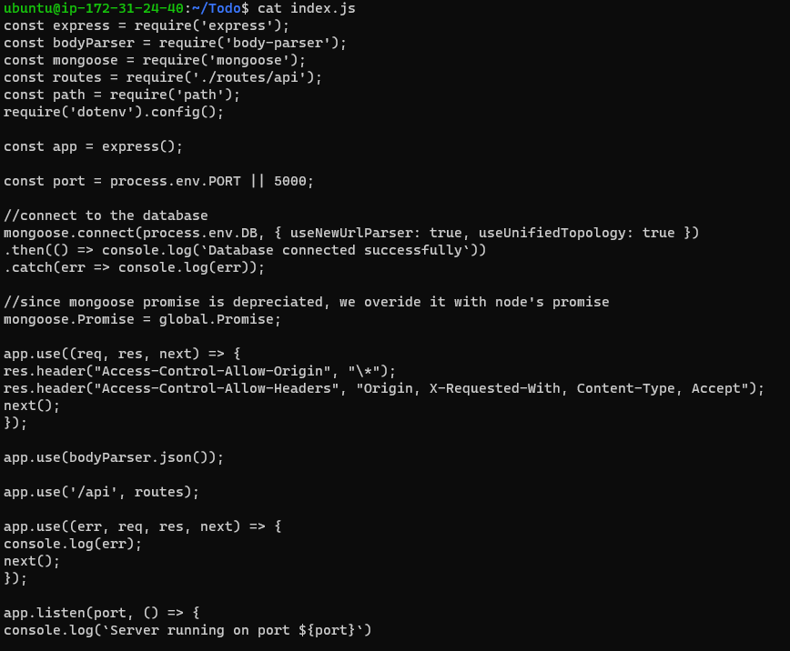

 22. Start server using;

  `node index.js`

  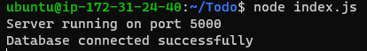

 ### Testing Backend Code without Frontend using RESTful API

 23.  Display a list of tasks – HTTP GET request

  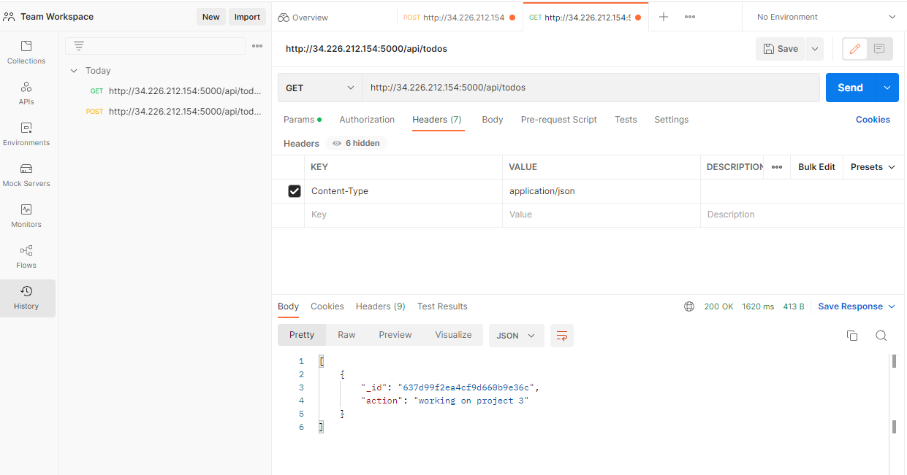

  Add a new task to the list – HTTP POST request

  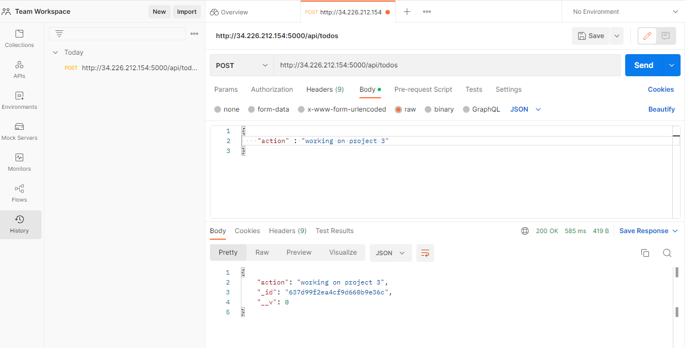
 

 ### Frontend Creation

 24. Create client directory in Todo directory

  `npx create-react-app client`

  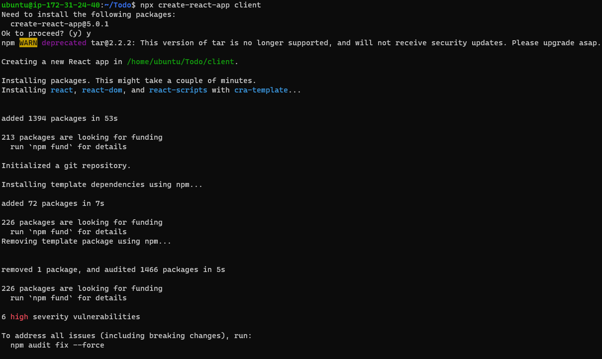

 - Install Concurrently

  `npm install concurrently --save-dev`

  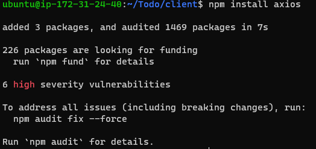

 - Install nodemon

  `npm install nodemon --save-dev`

  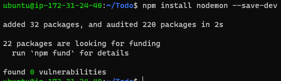

 
 25. Open and edit Package.Json

   `vi package.json`

   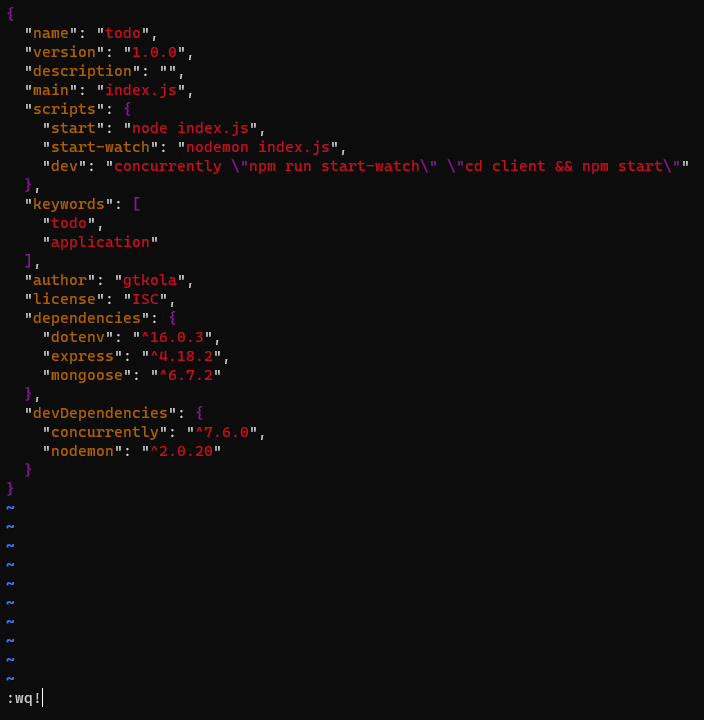

 ### Configure Proxy in package.json

 26. Change directory to Client and Open Package.Json

  `cd client`

  `vi package.json`

 27. Add key value pair in package.json

  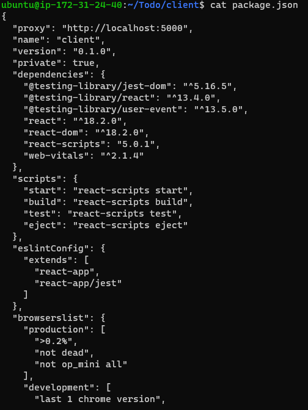

 28. To ensure you are inside the Todo directory, run;

  `npm run dev`

  - Run `localhost:3000`   

  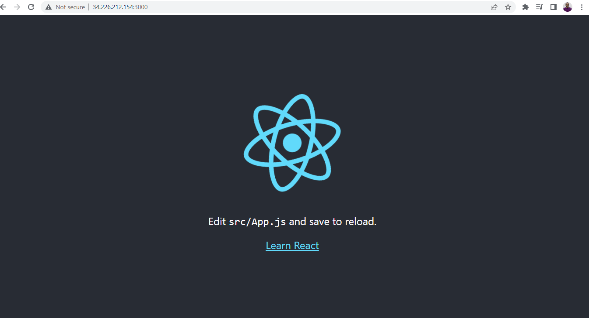 

 
 ### Creating your React Components

 29. From the Todo directory, chance directory to client, and then to src

 `cd Todo && cd client && cd src`

  

 30. Create and change directory to COMPONENTs

  `mkdir components`

  `cd components`

  

 31. Create 3 files 'Input, ListTodo, Todo' inside the directory COMPONENTs 

  `touch Input.js ListTodo.js Todo.js`

  - open input.js 

  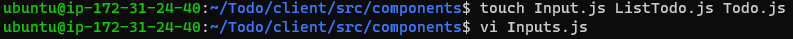

 32. Change directory back to client and install Axios

  `npm install axios`

  

 33. Change to components and edit ListTodo.js

   `cd src/components`

   - `vi ListTodo.js`

   then edit Todo.js

   - `vi Todo.js`

   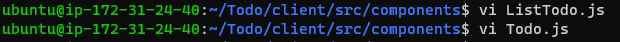

 34. Return to the src directory and edit the App.css file to delete the logo and adjust App.css

  `cd ..`

  `vi App.js`

  `vi App.css`

  - Also edit the index.css file

   `vim index.css`

 35. Return to Todo directory and run;

  `npm run dev`

  - Then reload the browser

   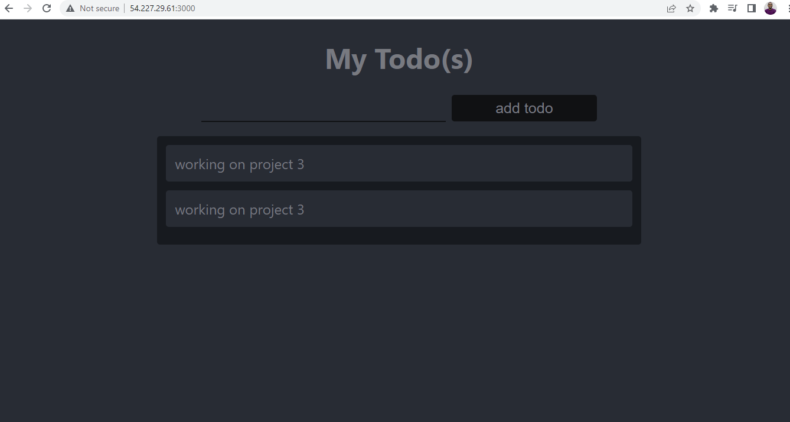

